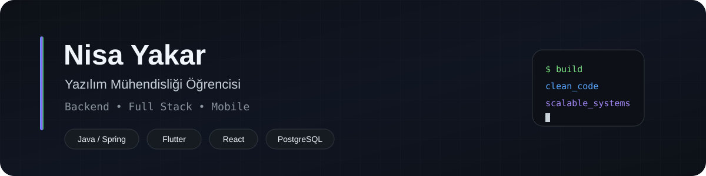
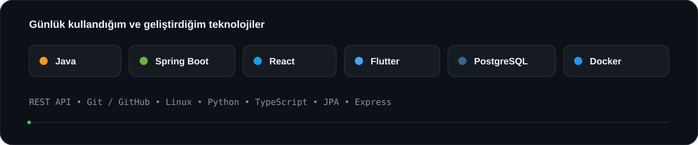
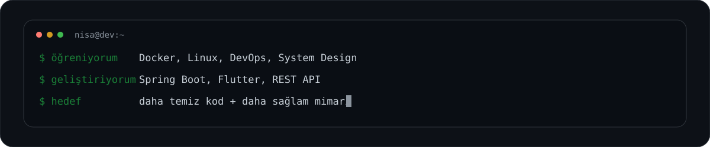
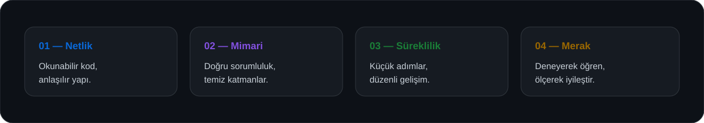

<picture>
  <source media="(prefers-color-scheme: dark)" srcset="./assets/header-dark.svg">
  <source media="(prefers-color-scheme: light)" srcset="./assets/header-light.svg">
  
</picture>

  <a href="https://github.com/Nisayakar"><b>GitHub</b></a>
  &nbsp;•&nbsp;
  <a href="https://www.linkedin.com/in/nisayakar"><b>LinkedIn</b></a>
  &nbsp;•&nbsp;
  <a href="mailto:lnisa.yakarl@gmail.com"><b>E-posta</b></a>

---

## Hakkımda

4. sınıf **Yazılım Mühendisliği** öğrencisiyim. Özellikle **backend geliştirme** ve **full stack uygulama mimarileri** üzerine çalışıyorum.

Ana odağım **Java & Spring Boot** ile sürdürülebilir backend servisleri geliştirmek. Bunun yanında **React** ve **Flutter** ile web ve mobil tarafta da üretmeye devam ediyorum.

Kodun yalnızca çalışmasına değil; **okunabilir, sürdürülebilir ve geliştirilebilir** olmasına önem veriyorum. Şu sıralar Docker, Linux, DevOps ve sistem tasarımı tarafında kendimi geliştiriyorum.

---

## Teknik Odağım

<picture>
  <source media="(prefers-color-scheme: dark)" srcset="./assets/stack-dark.svg">
  <source media="(prefers-color-scheme: light)" srcset="./assets/stack-light.svg">
  
</picture>

---

## Şu Sıralar

<picture>
  <source media="(prefers-color-scheme: dark)" srcset="./assets/focus-dark.svg">
  <source media="(prefers-color-scheme: light)" srcset="./assets/focus-light.svg">
  
</picture>

---

## Geliştirme Yaklaşımım

<picture>
  <source media="(prefers-color-scheme: dark)" srcset="./assets/principles-dark.svg">
  <source media="(prefers-color-scheme: light)" srcset="./assets/principles-light.svg">
  
</picture>

- Gereksiz karmaşıklık yerine **net ve anlaşılır çözümler**
- Backend tarafında **temiz katmanlar ve iyi API tasarımı**
- Veritabanında **doğru modelleme ve sürdürülebilir yapı**
- Küçük adımlarla sürekli geliştirme ve öğrenme

---

## Contribution Snake

  <picture>
    <source
      media="(prefers-color-scheme: dark)"
      srcset="https://raw.githubusercontent.com/Nisayakar/Nisayakar/output/github-contribution-grid-snake-dark.svg?v=6"
    />
    <source
      media="(prefers-color-scheme: light)"
      srcset="https://raw.githubusercontent.com/Nisayakar/Nisayakar/output/github-contribution-grid-snake.svg?v=6"
    />
    
  </picture>

---

  <b>İyi yazılım; çalışan koddan biraz daha fazlasıdır.</b>

  Öğreniyorum, geliştiriyorum ve her projede biraz daha iyi olmaya çalışıyorum.

