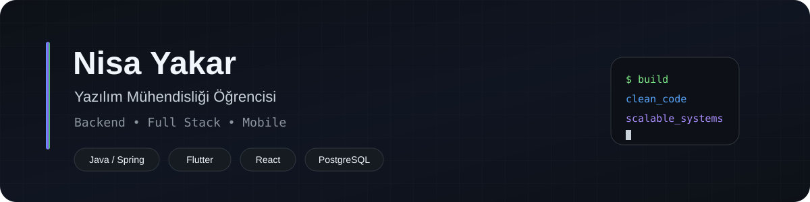
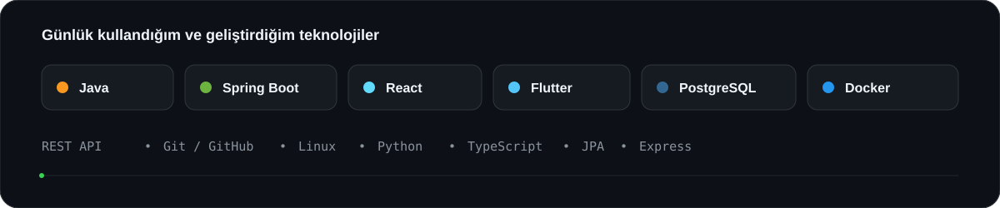
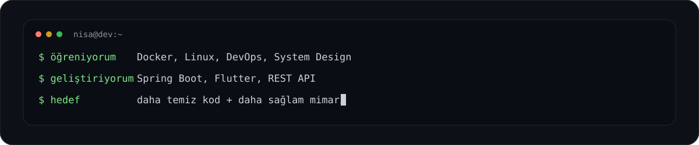
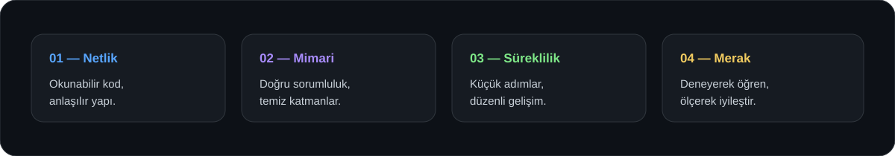

  

  <a href="https://github.com/Nisayakar"><b>GitHub</b></a>
  &nbsp;•&nbsp;
  <a href="https://www.linkedin.com/in/nisayakar"><b>LinkedIn</b></a>
  &nbsp;•&nbsp;
  <a href="mailto:lnisa.yakarl@gmail.com"><b>E-posta</b></a>

---

## Hakkımda

4. sınıf **Yazılım Mühendisliği** öğrencisiyim. Özellikle **backend geliştirme** ve **full stack uygulama mimarileri** üzerine çalışıyorum.

Ana odağım **Java & Spring Boot** ile sürdürülebilir backend servisleri geliştirmek. Bunun yanında **React** ve **Flutter** ile web ve mobil tarafta da üretmeye devam ediyorum.

Kodun yalnızca çalışmasına değil; **okunabilir, sürdürülebilir ve geliştirilebilir** olmasına önem veriyorum. Şu sıralar Docker, Linux, DevOps ve sistem tasarımı tarafında kendimi geliştiriyorum.

---

## Teknik Odağım

  

---

## Şu Sıralar

  

---

## Geliştirme Yaklaşımım

  

- Gereksiz karmaşıklık yerine **net ve anlaşılır çözümler**
- Backend tarafında **temiz katmanlar ve iyi API tasarımı**
- Veritabanında **doğru modelleme ve sürdürülebilir yapı**
- Küçük adımlarla sürekli geliştirme ve öğrenme
- Bir şeyi öğrenmenin en iyi yolu: **gerçek bir şey geliştirip bozmak, sonra düzeltmek**

---

## Contribution Snake

  

---

  <b>İyi yazılım; çalışan koddan biraz daha fazlasıdır.</b>

  Öğreniyorum, geliştiriyorum ve her projede biraz daha iyi olmaya çalışıyorum.

